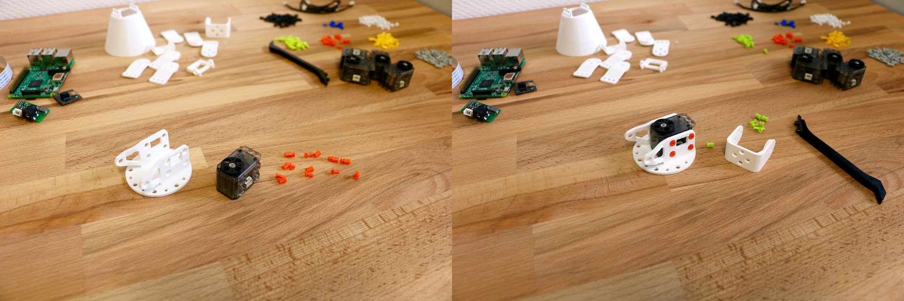
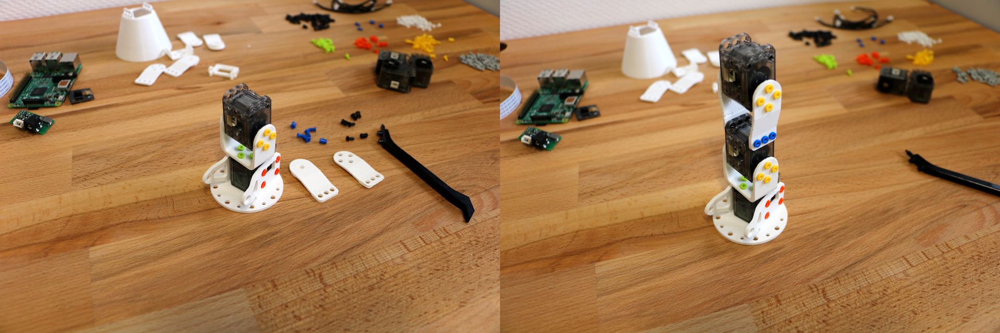
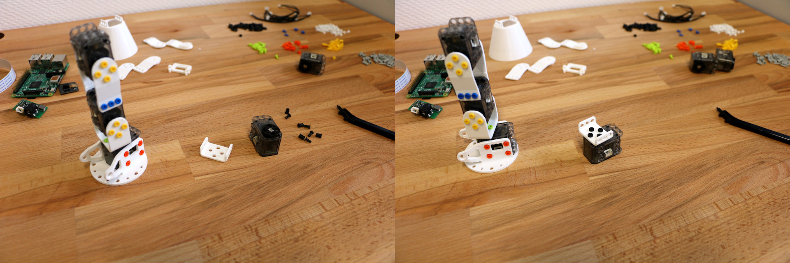
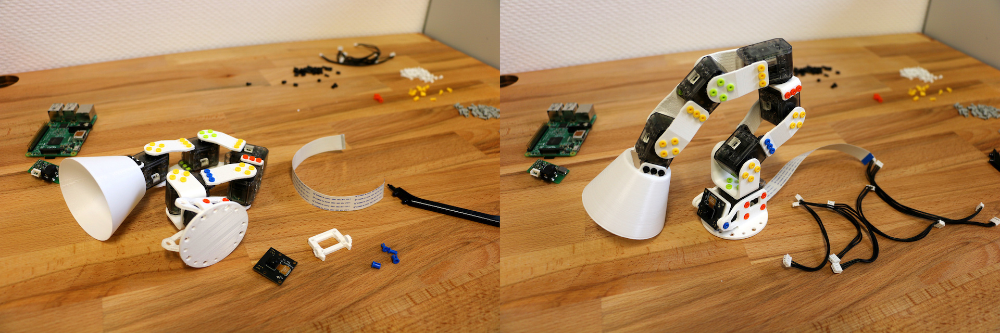

# Assemblage mécanique

## Avis et avertissements d'ordre général

<!-- TODO:
* picture rivet black vs grey
* ergo + wires
-->

* Vous pouvez assembler quelques rivets avant la construction. Vous devez insérer la tige de la première partie dans le trou de la seconde. Vous pourrez ainsi les enlever facilement si nécessaire.


* Il y a deux types de rivets : les gris et les autres. Les rivets gris sont plus longs afin de pouvoir les insérer à travers l'axe du moteur, par le côté opposé aux palonniers d'assemblage.

<!-- HTML link to adapt image size -->


* Utilisez l'outil OLLO pour pouvoir monter et démonter les rivets facilement.

<!-- HTML link to adapt image size -->


* N'oubliez pas d'insérer les fils entre les moteurs quand vous construisez le robot ! Chaque moteur, mis à part le dernier de la chaîne, doit avoir deux fils : un connecté au moteur précédent et l'autre au moteur suivant (le sens de connexion n'a pas d'importance).

* **Alignez toujours le palonnier (la roue d'entrainement noire) avec le moteur avant de les assembler !** Sinon votre Poppy Ergo Jr aura l'air tout à fait bizarre.

<!-- HTML link to adapt image size -->


* Tous les palonniers des moteurs (la roue d'entrainement noire) doivent être alignés **sur le côté gauche du robot**. C'est juste une convention mais elle définira l'orientation de vos moteurs.


## Guide pas à pas

### Configuration des moteurs (pour toutes les étapes)

Vous pouvez configurer vos moteurs avant, pendant ou après l’assemblage mécanique, mais il est vivement conseillé de configurer chaque moteur un par un dans l’ordre de construction : * configurer le moteur m1 * assembler la base et le moteur m1 * configurer le moteur m2 * ...

> **Attention** Pour configurer les moteurs, vous devez les connecter séparément un par un à la Raspberry Pi. Si vous essayez de configurer un nouveau moteur alors qu'il est connecté avec le moteur précédent, cela ne fonctionnera pas.

Pour plus d’informations, consultez la [section configuration de moteur](motor-configuration.md).

### Étape 1

Tout d’abord, [configurez un moteur XL-320](motor-configuration.md) comme « m1 ».

Monter le moteur sur la base imprimée en 3D.



Pour cela, préparez 8 petits rivets. Placez la première partie dans la seconde sans les mettre à l'intérieur du moteur. Ensuite, placez le moteur sur la base avec la palonnier faisant face au côté le plus ouvert. Utilisez l'outil Ollo pour attraper le rivet entre la première et seconde partie puis insérez le rivet dans un des trous d'assemblage. Une fois le rivet en place, verrouillez-le en poussant la première partie du rivet dans la seconde.

### Étape 2

Configurez le second moteur, son nom est « m2 », avec la commande suivante dans un terminal du robot :

```bash
poppy-configure ergo-jr m2
```

Monter la partie *long_U*. Soyez prudent avec l’orientation de la la pièce, le palonnier doit être orienté vers la gauche. Monter le moteur « m2 » sur le dessus de la construction.


### Étape 3

Configurer un troisième moteur : « m3 ».

Monter les pièces *horn2horn* et *horn2side* sur moteur « m2 » et monter « m3 » sur le dessus de la construction. 

### Étape 4

Configurer le quatrième moteur : « m4 ».

Monter la pièce *short_U* sur le moteur 4. 

Monter le moteur « m4 » et la pièce *short_U* préalablement assemblée au sommet de la construction. Le nez du moteur doit être orienté vers l'arrière de la base. 

### Étape 5

Configurer le cinquième moteur : « m5 ».

Monter les pièces *horn2horn* et *horn2side* sur moteur « m4 » et monter « m5 » sur le dessus de la construction.


### Étape 6 - l’outil de votre choix

Configurer le sixième moteur : « m6 ».

Pour terminer votre Ergo Jr, vous devez ajouter un outil à son extrémité. Choisissez un outil en fonction de ce que vous souhaitez faire.

> **Note** Les outils peuvent être facilement et rapidement changés, ce qui vous permet d'adapter votre robot aux différentes activités.

#### L'abat-jour ou le stylo

Monter les pièces *horn2horn* et *horn2side* sur moteur « m5 » et monter « m6 » sur le sommet de la construction. 

Vous pouvez monter le support de stylo ou de l’abat jour sur le moteur « m6 ». 

#### La pince

Monter la pièce [*gripper-fixation*](https://github.com/poppy-project/poppy-ergo-jr/blob/master/hardware/STL/tools/gripper-fixation.stl) entre les moteurs « m5 » et « m6 ».

Monter la pièce *gripper-fixed_part* et *gripper-rotative_part* sur moteur « m6 ». <!-- TODO closed picture of gripper-->

### Étape 7 - électronique

Monter le support caméra sur la base. Fixez la caméra Raspberry Pi dessus et faites passer la nappe de la caméra entre le moteur « m1 » et la base. 

Pour fixer le câble flexible de la caméra sur la Raspberry Pi : * Ouvrez le connecteur caméra en tirant l'attache vers le haut * Assurez vous que la partie bleu de la nappe est orientée vers le port Ethernet. * Poussez l'embout de la nappe au fond du connecteur et abaissez la partie supérieure du connecteur pour le fermer

<!-- TODO: add a closed picture of camera fix-->

**Les fils des moteurs :**

Si ce n'est pas déjà le cas, vous pouvez connecter tous les fils aux moteurs. Chaque moteur a deux connecteurs mais il n'y ni entrée ni sortie, vous devez simplement créer une chaîne de moteurs. Le premier moteur est connecté à la carte d'extension pixl et au second moteur. Le dernier moteur est lié seulement au moteur précédent, et tous les autres sont connectés aux moteurs précédent et suivant.

<!-- TODO picture of OLLO + base rivets -->

> **Info** Les connecteurs du moteur « m1 » (à la base) sont un peu difficiles à brancher, vous pouvez utiliser l’outil OLLO pour vous aider.


### Étape 8 - fixer votre Ergo Jr sur le disque de support en bois

Montez votre Ergo Jr sur le *disque de support* en bois.

Monter votre Raspberry Pi sur le disque de support, et utilisez une vis 4 x M2.5x6mm pour la fixer. <!-- TODO: picture of disk fixation -->

### C'est fini !


Vous pouvez désormais vous détendre en buvant [votre boisson préférée](https://www.flickr.com/photos/poppy-project/16488256337/).