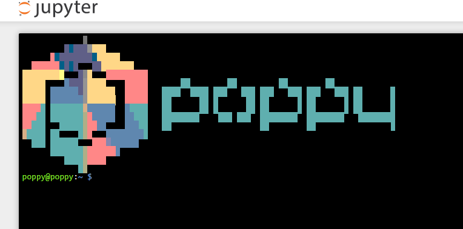

# Configuration des moteurs

L'Ergo Jr est composé de 6 moteurs XL-320 fabriqués par [Robotis](http://support.robotis.com/en/product/dynamixel/xl-series/xl-320.htm). Chacun de ces servomoteurs possèdent une carte électronique lui permettant de recevoir différents types de commandes (sur sa position, sa vitesse, son couple...) et de communiquer avec d’autres servos. Vous pouvez chainer ces servomoteurs entre eux et tous les commander depuis un bout de la chaîne.


Cependant, afin d’être connecté et identifié sur le même bus (de donnée), ils doivent avoir un identifiant unique. Sortis de l’usine ils ont tous la même valeur d'identifiant : 1. Dans cette section, nous vous donnerons plus de détails sur comment vous pouvez définir un nouvel identifiant unique à chacun de vos moteurs.

Nous vous recommandons de configurer des moteurs en parallèle de l’assemblage des pièces du robot. Ce qui signifie qu’avant d’assembler un moteur neuf, vous commencez par le configurer puis le monter sur le reste du robot. Pendant la procédure d'assemblage, nous indiquerons chaque fois qu'il faut configurer un nouveau moteur.

## Configurer les moteurs un par un

Comme expliqué ci-dessus, tous les moteurs ont le même identifiant par défaut. **Un seul moteur à la fois doit être connecté au bus de données lorsque vous les configurez.** Sinon, tous les moteurs connectés vont penser que l’ordre envoyé sur le bus leur est destiné, ils tenteront d'y répondre ce qui entrainera une "cacophonie" dans les réponses.

Lorsque vous configurez un moteur, vous devriez avoir ces éléments :

* une carte Raspberry Pi
* une carte pixl et son alimentation électrique
* un fil reliant la carte et le moteur que vous souhaitez configurer
* un câble Ethernet reliant la Raspberry Pi et votre ordinateur ou votre routeur

.

### Utilitaire en ligne de commande

Les robots viennent avec un utilitaire en ligne de commande `poppy-configure`. Pour l’utiliser, vous devrez ouvrir un terminal depuis l'interface Jupyter de votre Raspberry Pi.

Vous pouvez accéder au Raspberry Pi directement à partir de votre ordinateur. Pour ce faire, ouvrez la page http://poppy.local dans un navigateur web.

> **Attention** Si vous utilisez Windows, vous devrez installer [Bonjour](https://support.apple.com/kb/DL999) (voir [protocole Zeroconf](../../installation/install-zeroconf.md) pour plus de détails) afin de pouvoir vous connecter au robot en point à point en utilisant son nom (poppy. local par défaut). Si Bonjour n’est pas installé, vous aurez un message d’erreur comme celui-ci. Si Bonjour est installé et que le problème persiste, veuillez le ré-installer.
> 
> 

Si tout se passe bien, vous devriez voir la page d’accueil du robot :


Cliquez sur le lien **"Jupyter — Python, Terminal"** et après, sélectionnez sur la droite "New" et "Terminal". 

Vous avez maintenant accès au Terminal :



Une fois que le terminal est ouvert, copier et appuyez sur entrée pour exécuter la commande ci-dessous.

```bash
poppy-configure ergo-jr m1
```

Vous avez maintenant configuré le moteur m1 de votre robot. Une fois configuré et que vous voyez le message indiquant que tout s’est bien passé, vous pouvez débrancher le moteur (vous n’avez pas besoin de désactiver la carte). La configuration du moteur est sauvegardée dans sa mémoire interne (Eprom).

> **Info** Les moteurs du Poppy Ergo Jr sont nommées m1, m2, m3, m4, m5, m6. Pour configurer les autres moteurs, il faut changer m1 par le nom du moteur que vous souhaitez configurer dans la commande ci-dessus.

