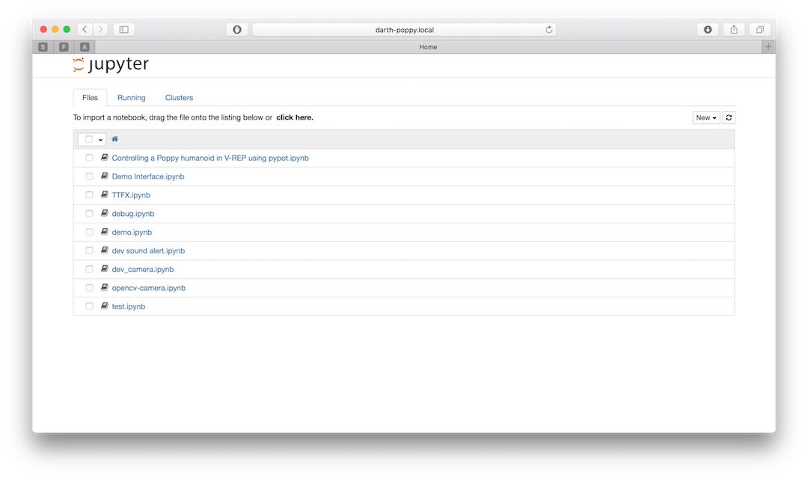
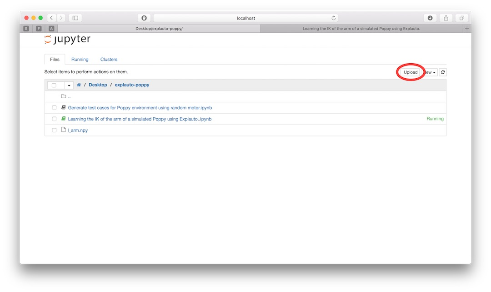
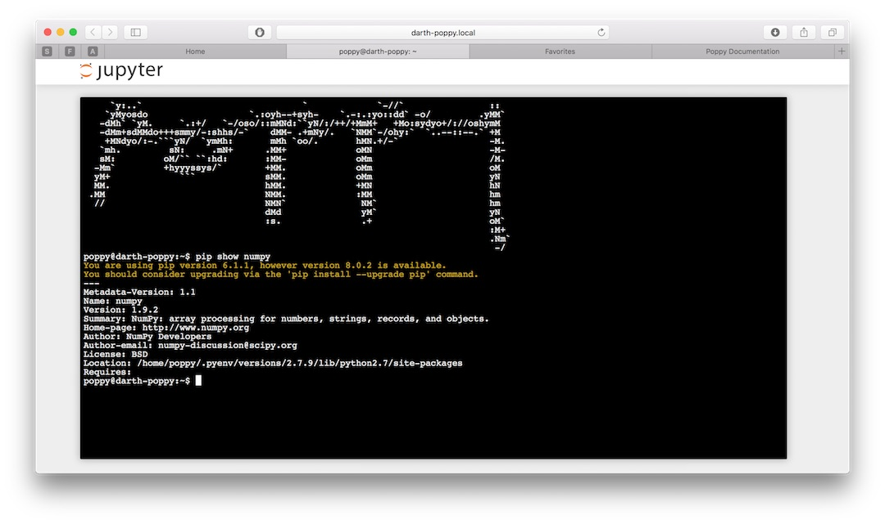

# À l’aide des notebooks Jupyter en Python

L'un des avantages de travailler avec les notebooks Jupyter est de pouvoir les utiliser dans une approche client/serveur.   
Chaque robot Poppy héberge un serveur Jupyter accessible via l'interface web (voir la [section démarrage rapide](../getting-started/program-the-robot.md) pour plus de détails).

Lorsque vous travaillez via une simulation, tout est géré et stocké sur votre ordinateur. Lorsque vous travaillez avec un robot physique vous pouvez le programmer depuis un navigateur web sur votre propre ordinateur, mais vos notebooks Jupyter sont en fait stockés et exécutés dans le robot.

Donc pour passer de la simulation au robot physique, vous devez passer de votre instance locale Jupyter à l'instance hébergée par le robot. Les étapes sont décrites ci-dessous.

## Se connecter à Jupyter sur le robot

Une fois connecté à l'interface web du robot *http://poppy.local* (nous supposerons ici que son nom d’hôte est *poppy*, remplacez-le par le nouveau nom d’hôte si vous l’avez changé), vous devriez voir un lien **ouvrir notebook Ipython**.


Lorsque vous cliquez dessus, Jupyter démarre sur le robot et vous redirige vers le serveur Web Jupyter. Vous devriez alors voir la racine du dossier notebook hébergé sur le robot :



C'est ici que vous pouvez mettre vos propre notebooks. Bien sûr vous pouvez créer des dossier, les organiser à souhait etc.

*Note : Si vous avez besoin d'un accès plus précis ou d'une configuration plus avancée (telle qu'une autorisation), vous devez vous connecter au robot directement en utilisant SSH.*

## Télécharger un notebook

Une fois connecté au serveur Jupyter hébergé par le robot, vous pouvez directement utiliser l’interface Jupyter pour le téléverser de nouveaux notebooks.



Le bouton rond permet de *télécharger* votre notebook local, stocké sur votre propre ordinateur, au robot. Ils peuvent alors être directement exécuté sur le robot.

*Sachez que pour le moment, nous ne traitons pas avec des autorisations ou des sessions (comme [JupyterHub](https://github.com/jupyter/jupyterhub) par exemple), et donc toute personne ayant accès au robot peut utiliser ou supprimer tous notebooks stockés dans le robot.*

## Adapter votre code

There is few places where you should actually modify your code so it works with a real robot. We try to minimize the effort needed as much as possible, yet some steps are still required.

### Instantiation

When creating the robot, you actually need to specify if you are willing to work with a real or a simulated robot. This is simply done via a parameter. For instance:

When working with V-REP:

```python
from poppy.creatures import PoppyHumanoid

poppy = PoppyHumanoid(simulator='vrep')
```

Will become for a real robot:

```python
from poppy.creatures import PoppyHumanoid

poppy = PoppyHumanoid()
```

Of course, this works for all existing Poppy creatures: Humanoid, Torso and ErgoJr.

This is most of the changes that you should do.

### Specific APIs

Some part of the API are platform specific. For instance, when using V-REP you have access to *tracking* features that let you retrieve any object 3D position. Of course, such method do not have a real world equivalent and thus are not available when working with a real robot.

A good practice if you want to write code compatible for both cases is to use the *simulated* property. It is automatically set to the correct value depending on how your instantiate your robot. For instance,

```python
poppy = PoppyHumanoid(simulator='vrep')

def reset_position():
    if poppy.simulated:
        poppy.reset_simulation()
    else:
        print('Ask one internship student to put the robot back in its origin position.')
        time.sleep(10)
```

## Version and 3rd party libraries

The main drawback of this client/server way of working is that your locally installed software versions may differ from the one installed on the robot.

The Python installed on the robot is Python 2.7 and comes with most of the scientific main libraries (numpy, scipy, matplotlib, opencv). An exhaustive list of the installed Python packages will be available soon <!-- (TODO!)-->. At the moment, the easier way to get it is to used a 

*terminal notebook* which can be directly run from the Jupyter interface.




Using the same technique, you can install 3rd party libraries directly on the robot. The [pip](https://pip.readthedocs.org) and [conda](http://conda.pydata.org/docs/) utility tools are installed and should be used when possible.

*Note that the embedded board are based on armv7 and thus some libraries may be hard to compile. We are maintaining a list of conda recipes specifically built for this platform [here](https://anaconda.org/poppy-project).  
Contributions are more than welcomed! *