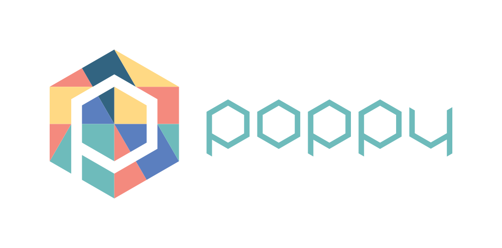
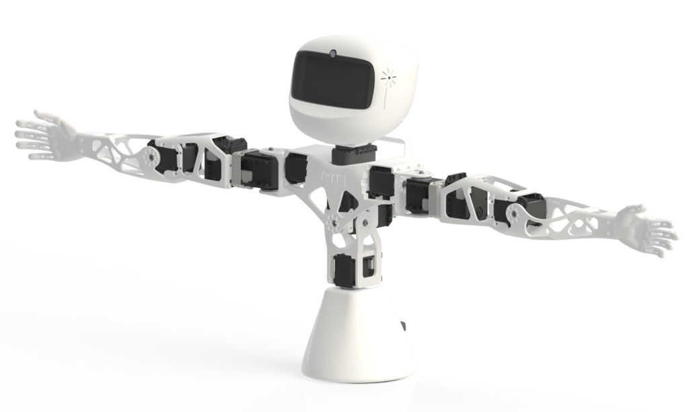

# Premiers pas

[Le projet de Poppy](https://www.poppy-project.org/) est une plate-forme open-source pour la création, l'utilisation et le partage de robots interactifs imprimés en 3D. Il rassemble une communauté interdisciplinaire de débutants, d'experts, de chercheurs, d'enseignants, de développeurs et d'artistes. Ils partagent tous une même vision : les robots sont de puissants outils pour apprendre et développer la créativité, et ils collaborent pour améliorer le projet. Ils développent de nouveaux comportements pour les robots, créent des contenus pédagogiques, élaborent des performances artistiques, améliorent le logiciel ou même conçoivent de nouveaux robots.

La [communauté Poppy](https://forum.poppy-project.org/) développe des créations robotiques qui sont faciles à construire, personnaliser et utiliser.

Un ensemble de services web permet à la communauté de partager leurs expériences et de contribuer à l'amélioration de la plateforme Poppy.

Pour faciliter ces échanges, deux supports sont disponibles :

* [Le forum de projet Poppy](https://forum.poppy-project.org/) pour avoir de l'aide, partager ses idées et en discuter.
* [GitHub](https://github.com/poppy-project) pour soumettre vos contributions et faire un suivi des bugs logiciels.

Toutes les sources du projet Poppy (logiciel et matériel) sont disponibles sur [ GitHub](https://github.com/poppy-project).

Le projet Poppy a été conçu initialement à [ Inria dans l'équipe Flowers](http://www.inria.fr/equipes/flowers/).

## Les robots Poppy

Les robots Poppy sont open source et libre. Leur sources sont disponible librement, il est possible de les modifier et de les redistribuer selon les termes prévus par leur licenses. Les pièces matérielles (carte électronique et modélisation 3D) sont sous license ([Creative Commons Attribution-ShareAlike](http://creativecommons.org/licenses/by-sa/4.0/) et le logiciel [GPLv3](http://www.gnu.org/licenses/gpl-3.0.en.html). Ils ont été tous conçus selon les même principes.

Les robots Poppy:

* sont fabriqués à partir de pièces imprimable en 3D et des servomoteurs Dynamixel,
* utilisent un ordinateur embarqué (Raspberry Pi ou Odroid pour les anciennes versions),
* fonctionnent avec une bibliothèque logicielle en Python, [pypot](../software-libraries/pypot.md), qui permet de contrôler les servomoteurs Dynamixel simplement,
* sont également contrôlable avec les même outils dans un simulateur ([V-REP](http://www.coppeliarobotics.com)),
* peuvent être contrôlé à l’aide d’un langage de programmation visuel ([Snap !](http://snap.berkeley.edu) une variante de Scratch) et un langage textuel [Python](https://www.python.org). Ils sont également programmables via une API REST, ce qui permet se s'interfacer avec d'autres languages de programmation
* viennent avec un documentation associée, des tutoriels, des exemples et des activités pédagogiques.

Ils peuvent être utilisés comme tels quels ou hackés (au sens de bidouillé) pour explorer de nouvelles formes, ajouter des capteurs, etc...

Pour obtenir votre propre robot Poppy, vous pouvez soit : * vous procurer toutes les pièces en suivant la liste du matériel (voir ci-dessous). * Acheter un des robots Poppy en kit complet chez notre [ revendeur officiel, Génération Robots](http://www.generationrobots.com/en/279-poppy-opensource-robotics-platform).

### Poppy Ergo Jr

Le robot Poppy Ergo Jr est un petit bras robot à faible coût avec dôté de 6 articulations. Il est fait de 6 moteurs peu cher (XL-320 servomoteurs Dynamixel servos) avec des pièces simples imprimés 3D.

Les pièces 3D ont été conçues pour être facilement imprimable sur une imprimante 3D basique. Les moteurs coûtent seulement 20€ chacun. L'accès à sa carte électronique est simple. Elle facilite la connexion des capteurs supplémentaires et est bien adaptée à des fins pédagogiques.

Vous pouvez choisir parmi trois outils à la fin de son bras :

* Un abat-jour.
* Une pince.
* Un porte stylo.

Les rivets utilisés rendent le changement d'outil simple à faire. Vous pouvez l’adapter selon le type d’activités que vous faites.

Poppy Ergo Jr est le robot idéal pour apprendre la robotique sans difficultés : assemblage simple, facile à contrôler et à un prix abordable.

Vous pouvez vous procurez toutes les pièces en suivant [la nomenclature](https://github.com/poppy-project/poppy-ergo-jr/blob/master/doc/bom.md) (BOM) et imprimer les [pièces 3D](https://github.com/poppy-project/poppy-ergo-jr/releases/) disponible au format STL.

Pour plus d'informations, jetez un coup d'oeil au [guide d'assemblage de l'Ergo Jr](../assembly-guides/ergo-jr/README.md).

### Poppy Humanoid

C’est un robot humanoïde composé de 25 articulations avec une colonne vertébrale entièrement actionnée. Il est utilisé pour l'éducation, la recherche (étude de la marche, l’interaction Homme-robot) ou encore pour des performances artistiques. D'un bras au robot complet, cette plateforme est activement utilisée dans les laboratoires, les écoles d'ingénieur, les fablabs et les projets artistiques.

Vous pouvez vous procurez toutes les pièces en suivant [la nomenclature](https://github.com/poppy-project/poppy-humanoid/blob/master/hardware/doc/BOM.md) (BOM) et imprimer les [pièces 3D](https://github.com/poppy-project/poppy-humanoid/releases/tag/hardware_1.0.1/) disponible au format STL.

### Poppy Torso

C'est la partie supérieure du robot Poppy Humanoid (13 articulations). Poppy Torso est donc plus abordable qu'un Poppy Humanoid. Ce robot offre une solution plus adaptée aux besoins de l'éducation, des associations et des bricoleurs. Poppy Torso can be a good medium to learn science, technology, engineering and mathematics (STEM).

You can get all the parts yourself following the [bill of material](https://github.com/poppy-project/poppy-torso/blob/master/hardware/doc/BOM.md). The [3D models](https://github.com/poppy-project/poppy-humanoid/releases/tag/hardware_1.0.1/) for the parts are the same as Poppy Humanoid, without the legs and with an extra [suction cup support](https://github.com/poppy-project/robot-support-toolbox/).

### Other interesting Poppy Creatures

A key aspect of the Poppy Project is to stimulate creativity and experimentation around robotics. We try to provide all the tools needed to design new robots based on the same technological bricks. Some new creatures are in development within the community. Some of them are presented in the section below.

#### Poppy right arm (work in progress)

Poppy right arm is a Poppy creature based on a right arm of Poppy Humanoid, with 3 additional XL-320 motors at the end to improve the reach and agility of the arm. It used the same gripper tool used in the Ergo Jr, designed to grab simple objects.

The project was realized during an internship at Inria Flowers by [Joel Ortiz Sosa](https://github.com/joelortizsosa). Find more info and the sources in the [repository](https://github.com/poppy-project/poppy-6dof-right-arm).

#### Small and low-cost humanoids

##### Heol

Heol - meaning "sun" in Breton - is a 34cm tall humanoid robot made by the association [Heol robotics](http://heol.io/). 23 motors compose it, all other parts are 3D printed. It also uses the pypot library for its movements.

Heol's purpose is to put a smile on ill children's faces. It can be an educational tool by becoming a learning support materials for programming and mechanical design.

Its participation in the RoboCup (World Cup football for robot) is also envisaged.

##### [Poppyrate](http://www.poppyrate.com/)

It a robot based on Poppy Humanoid. It aims at developing a more affordable version thanks to its smaller size and the use of cheaper motors. The size reduction also makes it easier to print the parts on a standard 3D-printer. Goals also involved making it as mobile and customizable as possible while maintaining compatibility with Poppy software.

Poppyrate will be sold as a kit (with and without the 3D parts) It has been designed by the society ZeCloud.

For more information, check their [Website](http://www.poppyrate.com/) - [Twitter](https://twitter.com/poppyratproject) - [Facebook](https://www.facebook.com/Poppyrate/)!