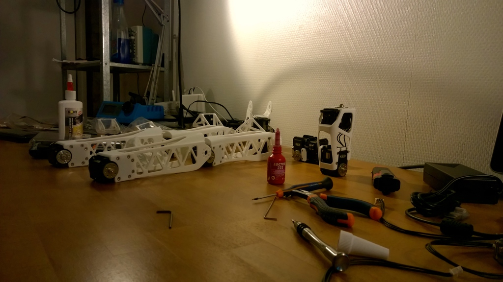

# Assembler le robot

Le temps d'assemblage, les compétences requises, les outils et la difficulté varient selon selon les robots Poppy que vous voulez utilisez. Alors que construire un Ergo Jr devrait vous prendre environ une heure et cela sans outil spécifique, assembler un Humanoid peut vous prendre plusieurs jours et un sacré nombre de vis !

Cette section permet de vous donner des astuces et quelques détails nécessaires avant de s'immerger dans l'assemblage du robot.

Plus de ressources et une documentation d'assemblage pas à pas sont disponible pour chaque robot dans la section [guide d'assemblage](../assembly-guides/README.md) .

## Assembler un Ergo Jr

> **Note** Vous retrouverez la documentation complète de l'assemblage dans le chapitre [assemblage pas-à-pas de l'Ergo Jr](../assembly-guides/ergo-jr/README.md).

<!-- TODO: refaire une belle photo avec la vraie BOM -->

L'Ergo Jr a été conçu pour être un petit robot, simple, peu onéreux et facile à utiliser. Les pièces 3D ont été conçues pour être facilement imprimable en 3D et les moteurs (6 servomoteurs Dynamixel XL-320) coûtent 20€ chacun.

Grâce aux rivets OLLO, le robot est facile à assembler. Ces rivets peuvent être enlevés ajoutés rapidement avec l’outil OLLO. Construire ce robot ne devrait pas vous prendre plus d'une heure.

Son effecteur peut être facilement changé. Vous pouvez choisir parmi plusieurs outils : * un abat-jour, * une pince, * ou un porte-stylo.

<!-- TODO: image des rivets et du tool en action -->

A part la **vérification de l'orientation des moteurs**, il n'y a pas vraiment de piège. Si vous êtes familier avec les briques Lego, vous devriez pouvoir assembler Ergo Jr sans trop de problème ! Les rivets ont été pensé pour que l'assemble soit aussi facile que le désassemblage. Donc en cas de problème, vous n'avez qu'à recommencer !

Par ailleurs, faites attention à [**configurer vos moteurs**](../assembly-guides/ergo-jr/motor-configuration.md) avant d'assembler le robot, ce sera plus difficile de le faire après !

## Assembler un Torso ou un Humanoid

> **Note** Vous pouvez trouver la documentation complète de l’assemblage dans le chapitre [montage pas-à-pas du robot Humanoid](../assembly-guides/poppy-humanoid/README.md).

Construire un Poppy Torso ou un Humanoid est beaucoup plus complexe que le robot Ergo Jr, mais ce n'est pas vraiment plus compliqué que de construire un Meccano ou des meubles suédois. Cela consiste en ces quelques étapes :

<!-- TODO: add links of the advanced doc -->

- assembler le palonnier de chaque moteur : **soyez attentif à ce que le moteur soit bien sur sa position initiale, son zéro !**
- configurer les moteurs afin qu'ils coïncident avec la *configuration Poppy*
- utiliser un grand nombre de vis pour connecter toutes les pièces 3D aux moteurs
- faire un peu d'électronique pour la carte embarquée au niveau de la tête : cela peut se révéler un peu difficile si vous n'êtes pas familier avec cette discipline.

**La patience et la précision** sont vos meilleurs atouts, mais en cas d'erreurs, pas de panique : les robots Poppy sont faits pour être montés et démontés. Si vous faites attention des **mises en garde** suivantes, après quelques essais/erreurs vous aurez un Poppy Torso ou Humanoid en état de marche :

*Mise en garde 1 : Les robots Poppy Humanoid ou Torso fonctionnent principalement avec des servomoteurs Dynamixel MX-28 et MX-64. Ils sont plutôt puissants et peuvent être dangereux si l'on s'y coince les doigts. Donc soyez prudent et mettez le robot dans un environnement dégagé pendant que vous le testez !*

*Mise en garde 2 : Alignez le palonnier avec le repère sur l'axe du servomoteur.*

*Mise en garde 3 : Ajustez les trois repères du palonnier avec les trois repères de la pièce 3D.*

*Mise en garde 4 : Utilisez du frein filet pour éviter le déliement des vis dues aux vibrations. Cependant, poser l'extrémité de la vis sur le frein filet est amplement suffisant. **Si vous mettez trop de frein filet vous risquez de coller définitivement vos vis et rendre très compliqué tout démontage !***

<!-- TODO: Add directly the youtube playlist of poppy torso and humanoid-->

**Guide d'assemblage pas-à-pas :**

- [Guide pour Poppy Humanoid](https://github.com/poppy-project/poppy-humanoid/blob/master/hardware/doc/Poppy_Humanoid_assembly_instructions.md)
- [Guide pour Poppy Torso](https://github.com/poppy-project/poppy-torso/blob/master/hardware/doc/Poppy_Torso_assembly_instructions.md)