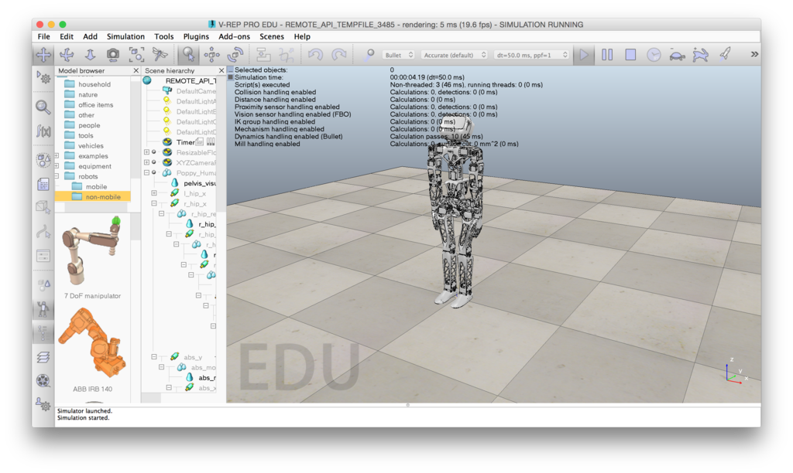
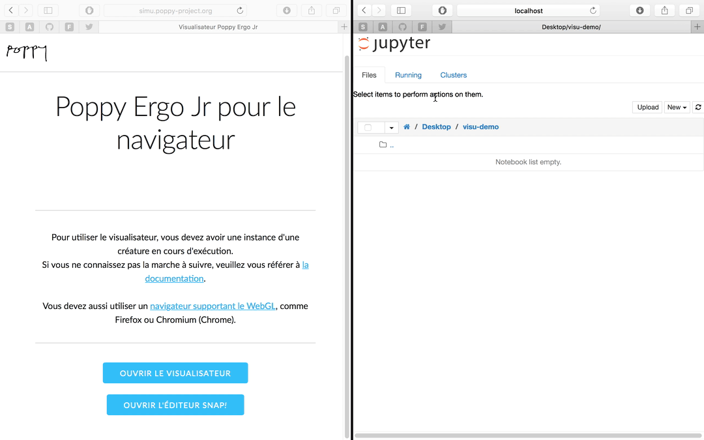

# Utiliser les robots dans un simulateur

## Robots Poppy simulés

Une version simulée de chaque robot Poppy est disponible (Humanoid, Torso, Ergo Jr).

On peut utiliser deux « simulateurs » avec les robots Poppy : * [ V-REP](http://www.coppeliarobotics.com) : un simulateur de robotique avec de nombreuses possibilités et très utilisé * [ un visualisateur web-3D](http://simu.poppy-project.org) : plus léger, mais sans simulation physique

> **Attention** Pour le moment seul l'Ergo Jr peut être utilisé dans le visualiseur web. Si vous souhaitez simuler d’autres créatures, vous devez utiliser V-REP. On souhaiterai prendre en charges les autres robots, mais aucun calendrier n'est fixé sur ce point là.

L'utilisation d'un simulateur est très intéressante. Cela permet de développer et d'essayer des programmes sans avoir besoin d'un vrai robot. Plus particulièrement, cela permet :

* De découvrir et tester les possibilités du robot sans avoir à dépenser d'argent.
* De travailler dans un contexte où plusieurs utilisateurs partagent un robot. Par exemple, dans une salle de classe, chaque élève peut travailler en utilisant le simulateur et venir valider son programme sur le robot tangible.
* D'économiser du temps dans la conception et réalisation d'expériences.

Nous essayons de faire en sorte que **le passage du robot virtuel au tangible soit aussi transparente et simple que possible**. La plupart des exemples de programmation et de la de documentation du code sont ainsi valable aussi bien pour les robots simulés que tangibles. Le chapitre *[ de la simulation au robot tangible](../from-simulation-to-real-robot/README.md)* vous guidera dans les étapes pour adapter votre programme fonctionnant dans le simulateur vers l'usage d'un robot tangible.

> **Attention** Si vous souhaitez utiliser des robots Poppy dans un simulateur vous devrez installer le simulateur ainsi que librairies logicielles sur votre ordinateur.

## Installer les logiciels nécéssaire

> **Pour information** : Une section entière est dédiée à comment *[installer tout en local dans le but d'utiliser un simulateur](../installation/install-poppy-softwares.md)* si vous avez besoin de plus de renseignements.

Alors que les robots physiques disposent d'un ordinateur embarqué pré-installé, vous devez installer certaines bibliothèques logicielles sur votre ordinateur pour contrôler les créatures Poppy simulées. Vous n'aurez pas accès à l'interface web du robot. Vous devrez lancer manuellement les différents services pour commencer à programmer votre robot (le terminal Jupyter pour les notebooks Pyhton ou le terminal Snap_ ! _).

Pour commencer à contrôler un robot Poppy, que ce soit en utilisant V-REP ou le visualiseur web, vous aurez besoin : *Pour faire fontionner Python, nous recommandons fortement d’utiliser la [distribution Python Anaconda](https://www.continuum.io/downloads). Il fonctionne avec n’importe quelle version > = 2.7 ou > = 3,4. Préfèrez Python 2.7 si vous le pouvez, car c’est la version que nous avons utilisé. * Pour installer les bibliothèques Poppy : pypot et la bibliothèque correspondant à votre créature (p. ex. poppy-ergo-jr).

## Avec V-REP

[ V-REP](http://www.coppeliarobotics.com) est un simulateur de robotique très populaire aux nombreuses fonctionnalités. Il est très utilisé dans pour la recherche ou des fins éducatives. De plus, il est disponible gratuitement avec la license éducative. Il peut être téléchargé depuis [ le site de Copellia Robotics](http://www.coppeliarobotics.com/downloads.html) (fonctionne sous Mac OS, Windows et GNU/Linux).

> **Attention** Etant donné que V-REP effectue une simulation physique ainsi qu'un rendu graphique du robot, il nécessite un ordinateur puissant (surtout pour la carte graphique).



Tous les principaux robots Poppy sont disponibles dans V-REP : * Poppy Humanoid * Poppy Torso * Poppy Ergo Jr

V-REP permet d’apprendre à commander les moteurs, interroger les capteurs, mais aussi d’interagir avec l’environnement simulé. It can be controlled using Python, Snap_!_ or through the REST API. Here, are some examples of what the community has already been doing with it: * A pedagogical activity to discover the different motor of your robot and how they can be controlled. * A scientific experiment, where a Poppy Torso is learning how to push a cube on a table in front of it


> **Note** Even if we try, to reproduce the robot behavior and functioning, some differences remain. In particular, if you make a robot walk in simulation that does not necessarily mean that it will walk in the real world (and vice-versa).

To start the simulated robot, first open V-REP and instantiate you robot with `simulator='vrep'` argument. V-REP will open a popup that you will have to close to enable to communication between V-REP and Python.

```python
from pypot.creatures import PoppyErgoJr
robot = PoppyErgoJr(simulator='vrep')
```

If you want to control a simulated robot from Snap, you can also start it directly from the command line interface `poppy-services` in your terminal (called command prompt on Windows):

```bash
poppy-services --vrep --snap poppy-ergo-jr
```

## Using our web visualizer

Our web visualizer will show you a 3D representation of a Poppy robot. For this, you will need to connect it to either a real robot (through the REST-API) or to a simple mockup robot running on your computer. You simply have to set the host variable from within the web interface to match the address of your robot.


In Python, you can start the mockup robot with:

```python
from pypot.creatures import PoppyErgoJr
robot = PoppyErgoJr(simulator='poppy-simu')
```

Add a `use_snap=True` argument if you want to start Snap API.

If you want to use command the mockup robot from Snap, you can also start it directly from the command line interface `poppy-services` in your terminal (called command prompt on Windows):

```bash
poppy-services --poppy-simu --snap poppy-ergo-jr
```

As for V-REP, you can control your robot using Python, Snap_!_, or the REST API. Yet, there is no physics simulation so its lighter but you will not be able to interact with objects.

Here is an example with Python:

