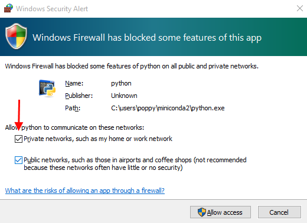

# Install the robotic simulator V-REP

> **Info** You need to install [Poppy softwares](install-poppy-softwares.md) before installing the V-REP simulator.

[V-REP](http://www.coppeliarobotics.com) is an efficient robotic simulator mainly open source (GNU GPL), which is distributed under a free license for educational entities and have a commercial license for other purposes. There is also an *PRO EVAL* version which limit the right to backup. As you don't need to backup the scene to use V-REP with pypot (the Python library made for Poppy creatures), we suggest you to install this version to not worry about copyright infringement. If you want to modify the V-REP scene for adding or customizing a Poppy creature, you will have to use the PRO or the EDU version (look at the [educational license](http://www.coppeliarobotics.com/licensing-plugin-edu.html)).

## Install V-REP on Windows

[Télécharger V-REP](http://www.coppeliarobotics.com/downloads.html) PRO EVAL ou EDU (si vous êtes un établissement scolaire). V-REP n'étant pas signé, vous devrez valider la fenêtre popup SmartScreen (sur Windows 10) pour commencer l'installation. 

Pendant l'installation, veillez à installer * Visual C++ Redistributable 2010 * et * Visual C++ Redistributable 2012 *. 


Si les versions de * Visual C++ Redistributable 2010 * ou * Visual C++ Redistributable 2012 * sont déjà présent sur votre ordinateur, il est conseillé de les "réparer" (il s'agit du processus de ré-installation).


**Après l'installation, vous pouvez[ réaliser un test pour vérifier si V-REP fonctionne bien ](#test-your-installation) **.

## Installation sous MAC OSX

<!-- TODO -->

> **Attention** Ce paragraphe doit être complété. Votre aide est la bienvenue !

## Installation sous GNU/Linux

<!-- TODO -->

> **Attention** Ce paragraphe doit être complété. Votre aide est la bienvenue !

## Testez votre installation

Ouvrez V-REP avec un double clic sur l'icône du bureau. Ouvrez l'invite de commande de votre distribution Python (appelée *Anaconda prompt* pour Anaconda) ou l'*Invite de commande* de Windows, tapez et validez en appuyant sur entrée pour exécuter la commande ci-dessous :

```bash
poppy-services --snap --vrep --no-browser poppy-torso`
```

Après une ou deux secondes, vous devez avoir une erreur dans votre invite de commande comme le montre l'image ci-dessous. 

Si vous passez à la fenêtre V-REP, un popup apparaît pour vous informer que la simulation utilise des paramètres personnalisés. Cette popup bloque la communication vers l'API Python de V-Rep. **Vous devez vérifier que la case "Do not show this message again" est bien coché et appuyez sur "Ok".** 

Revenez vers l'invite de commande Windows. You will have to execute the last command (`poppy-services --snap --vrep --no-browser poppy-torso`) and click again to the V-REP popup (with the check-box checked). **This process will have to be done *three times* to make it works well!**

> **Info** To avoid retyping the same command again and again, you can press the up arrow key to call the last typed line.

When the setup of V-REP is ready, you can execute the last command without the "--no-browser" part.

    poppy-services --snap --vrep poppy-torso
    

If you see a firewall popup like the picture below, be sure to check the "private network" check-box.



If everything works, a new tab have been opened on your default web-browser. <!-- TODO: lien doc --> You can program you robot in Snap_!_ or in Python.

